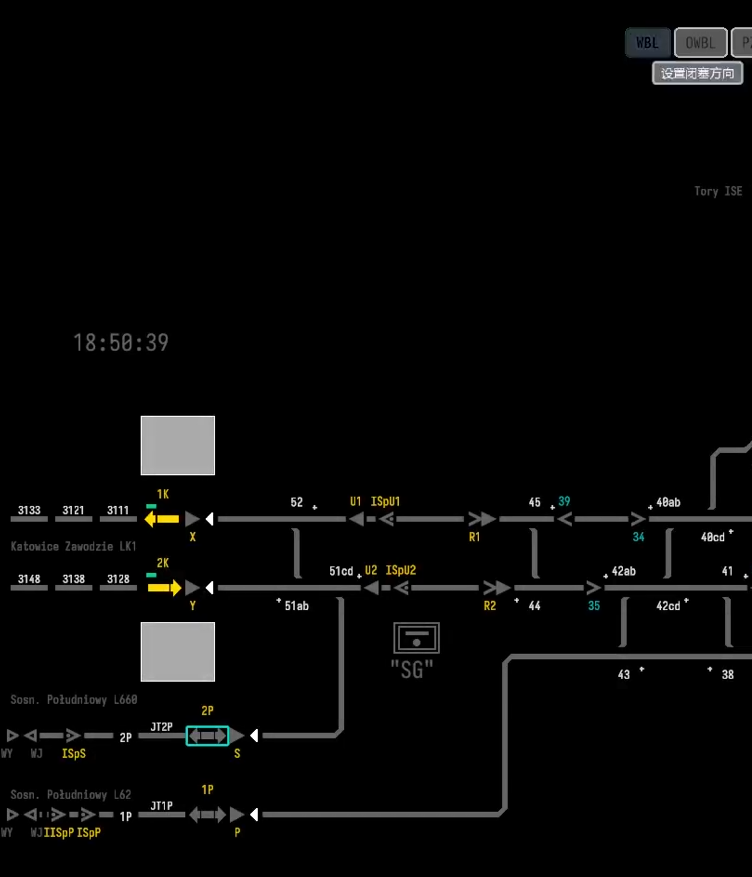
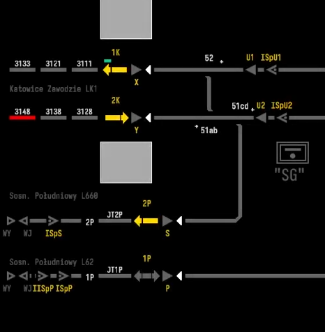
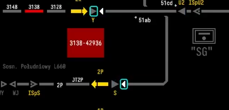
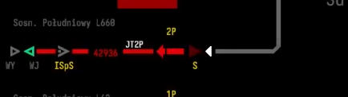
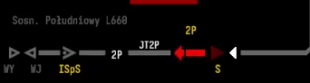
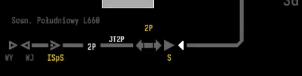
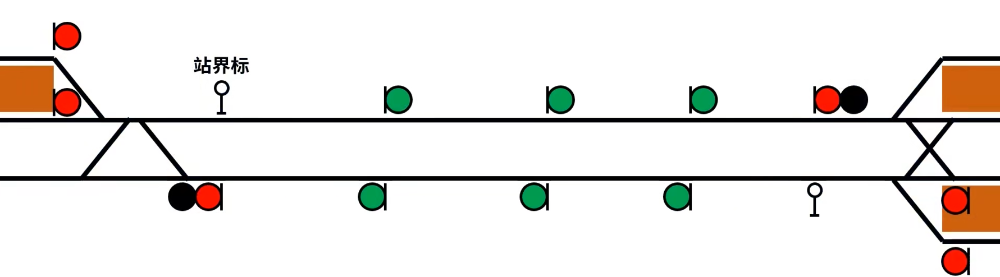
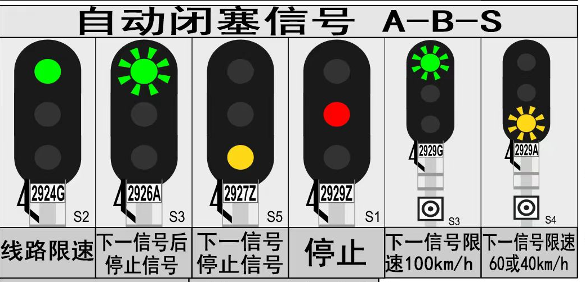

## 二、列车的秩序美
#### 2.1 闭塞信号

**2.1.1闭塞的定义**

```
闭塞就是用信号或者凭证，保证列车按照前行列车和追踪列车之间
必须保持一定距离(空间间隔制)运行的技术方法。
指列车进入区间后，使之与外界隔离起来，
区间两端车站都不再向这一区间发车，以防止列车相撞和追尾
```

*闭塞定义图*

---
**2.1.2闭塞的发展历程**

- 1.时间间隔法
```
19世纪40年代以前，列车运行是采用时间间隔法。即先行列车发出后，隔一定时间再发出同方向的后续列车。这种方法的主要缺点是不能确保安全。当先行列车运行不正常时（晚点或中途停车等），有可能发生后续列车撞上前行列车的追尾事故。
因为列车制动距离长，如果列车已经到达了区间运行速度，那么看到前车再制动已经是来不及了。
```

*时间间隔法*

- 2.空间间隔法
```
1842年英国人库克提出了空间间隔法，即先行列车与后续列车间隔开一定空间的运行方法。
因为它能较好地保证行车安全而被广泛采用，逐步形成铁路区间闭塞制度。
而这种闭塞需要一个物品作为凭证，这种凭证需要有唯一性，才能保
证单一区间只能有一个列车。
而且使用单一凭证的闭塞方式，只能上行一趟，下行一趟。如果上行的列车有两辆，
那么由于第一辆车的凭证留置在了下一个车站，
本车站的凭证没法发放给第二辆车，导致了时间的浪费。
```

*空间间隔法*

- 3.电话闭塞
```
由于实体介质的流动性差，随着电话的发明，以电话为信息的传递介质投入了使用。

1.首先列车从甲站点出发时，该站需要和下一个站（乙站）请求闭塞
2.甲乙两站确定区间空闲，乙站同意闭塞
3.列车凭路票发车，乙站确定列车编组完整，废除路票
4.乙站向甲站通知解出闭塞

现在仍有部分地方使用电话闭塞，由于电话闭塞部署简单，而且在规范的章程下基本能完成
区间闭塞的任务
```


**缺点：**
```
安全性差：
电话闭塞法的安全性较低，主要原因是它完全依赖人工操作和制度约束，没有机械或电气设备的控制。
这种方法在信号设备故障或无法使用时作为替代方案使用，但由于人为因素的不可控性，
容易出现操作失误或沟通不畅，导致安全隐患。

一个典型的例子是上海10号线列车追尾事故，因为自动驾驶系统失效，转用电话闭塞方式。
事故的主要原因是信号系统故障后，调度员在未准确定位所有列车位置的情况下，
违规发布了电话闭塞命令。这起事故引发了对地铁运营安全的广泛关注，并促使相关部门加强了安全管理措施。

```

- 4.电气路签或电气路牌闭塞
```
由于电话闭塞安全性低，人们使用了一个更为安全的闭塞方式。上文提到单一凭证效率很低，而且不够灵活。
以路牌为例，路牌为铜质，中心空心形状不同。每种形状在不同的闭塞区间使用，站内有路牌机放置大量的路牌。
```

```
当列车需要从甲站出发到乙站时：
1.甲站电话通知乙站，办理闭塞。
2.乙站向甲站的路牌机供电，列车就能从甲站的路牌机取出路牌
3.两站的路牌机闭锁，都无法取出路牌
4.乙站把列车的路牌送到乙站的路牌机，才能解除闭锁

这样就实现了安全性较高的闭塞方式

```


---

**2.1.3 半自动闭塞**

    上文提到的闭塞都属于人工闭塞，不仅效率低下并且安全性也不是很高。
    半自动闭塞的出现很好的解决了这一问题。
    半自动闭塞多用于单线，半自动闭塞的建立也需要两个车站的同意：
    
    1.甲站联络乙站是否能建立闭塞
    2.甲站在计算机或者继电器连锁控制台上发出建立闭塞请求
    3.乙站同意控制台上的请求
    4.甲乙站会生成一条可供列车行驶的绿色信号带
    5.列车进入单线后，该区间占用，无法再建立进路
    6.直到列车离开区间，并且乙站在控制台上确定列车到达且编组完整，
    该区间才可供重新申请建立进路


我们拿波兰的计算机联锁示意，该站为波兰的索斯诺维兹总站的模拟器模拟：

1.设置闭塞方向


2.建立闭塞



3.建立进路



4.开放进路


5.列车在单线区间中



6.列车到达乙站但乙站还未确定



7.乙站确定，区间释放



---

**2.1.4 自动闭塞**

```
尽管说半自动闭塞已经能基本实现安全的单线运输，但是随着站与站之间距离的变长以及双线的出现，半自动闭塞又产生了新的问题
如果两站的距离很长，那么只能等待这个列车到达下一站才能发出一辆新的列车。那么就会产生很大的延误。
为了能更好的利用站与站之间的区间，我们将站之间的一个区间，分段并形成了多个的区间。
并且在每个闭塞区间都放置一个自动闭塞信号机，就能保证站与站之间可以同时存在多辆列车。
于是自动闭塞产生了。
```

```
我们拿波兰的信号系统举例子，在每个区间前都会有一个区间的信号机，不同的颜色代表不同的意思。
```
|灯色    |     意义|
|--------|--------|
|常绿    |    区间限速    |
|绿闪|下两个区间为停止信号|
|常黄|下一个区间为停止信号|
|红|停止信号|
|绿闪并有最后一个自动闭塞信号机提示|站内限速100KM/h|
|黄闪并有最后一个自动闭塞信号机提示|站内限速60/40KM/h|



#### 2.2 

#### 2.3

---
## 3. 更安全更智能的制动

#### 3.1 直接式空气制动机

#### 3.2 全自动空气制动机

#### 3.3 电控空气制动机
