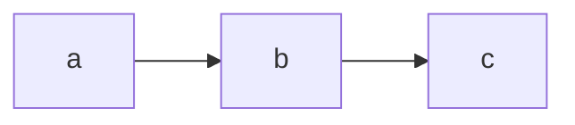

## 二、列车的秩序美
#### 2.1 闭塞信号

**2.1.1闭塞的定义**

```
闭塞就是用信号或者凭证，保证列车按照前行列车和追踪列车之间
必须保持一定距离(空间间隔制)运行的技术方法。
指列车进入区间后，使之与外界隔离起来，
区间两端车站都不再向这一区间发车，以防止列车相撞和追尾
```

*闭塞定义图*

**2.2.2闭塞的发展历程**

#### 2.2 列车信号系统

#### 2.3

---
## 3. 更安全更智能的制动

#### 3.1 直接式空气制动机

#### 3.2 全自动空气制动机

#### 3.3 电控空气制动机
