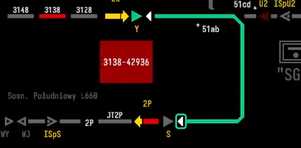

## 二、列车的秩序美
#### 2.1 闭塞信号

**2.1.1闭塞的定义**

```
闭塞就是用信号或者凭证，保证列车按照前行列车和追踪列车之间
必须保持一定距离(空间间隔制)运行的技术方法。
指列车进入区间后，使之与外界隔离起来，
区间两端车站都不再向这一区间发车，以防止列车相撞和追尾
```

*闭塞定义图*

---
**2.1.2闭塞的发展历程**

- 1.时间间隔法
```
19世纪40年代以前，列车运行是采用时间间隔法。即先行列车发出后，隔一定时间再发出同方向的后续列车。这种方法的主要缺点是不能确保安全。当先行列车运行不正常时（晚点或中途停车等），有可能发生后续列车撞上前行列车的追尾事故。
因为列车制动距离长，如果列车已经到达了区间运行速度，那么看到前车再制动已经是来不及了。
```

*时间间隔法*

- 2.空间间隔法
```
1842年英国人库克提出了空间间隔法，即先行列车与后续列车间隔开一定空间的运行方法。
因为它能较好地保证行车安全而被广泛采用，逐步形成铁路区间闭塞制度。
而这种闭塞需要一个物品作为凭证，这种凭证需要有唯一性，才能保
证单一区间只能有一个列车。
而且使用单一凭证的闭塞方式，只能上行一趟，下行一趟。如果上行的列车有两辆，
那么由于第一辆车的凭证留置在了下一个车站，
本车站的凭证没法发放给第二辆车，导致了时间的浪费。
```

*空间间隔法*

- 3.电话闭塞
```
由于实体介质的流动性差，随着电话的发明，以电话为信息的传递介质投入了使用。

1.首先列车从甲站点出发时，该站需要和下一个站（乙站）请求闭塞
2.甲乙两站确定区间空闲，乙站同意闭塞
3.列车凭路票发车，乙站确定列车编组完整，废除路票
4.乙站向甲站通知解出闭塞

现在仍有部分地方使用电话闭塞，由于电话闭塞部署简单，而且在规范的章程下基本能完成
区间闭塞的任务
```


**缺点：**
```
安全性差：
电话闭塞法的安全性较低，主要原因是它完全依赖人工操作和制度约束，没有机械或电气设备的控制。
这种方法在信号设备故障或无法使用时作为替代方案使用，但由于人为因素的不可控性，
容易出现操作失误或沟通不畅，导致安全隐患。

一个典型的例子是上海10号线列车追尾事故，因为自动驾驶系统失效，转用电话闭塞方式。
事故的主要原因是信号系统故障后，调度员在未准确定位所有列车位置的情况下，
违规发布了电话闭塞命令。这起事故引发了对地铁运营安全的广泛关注，并促使相关部门加强了安全管理措施。

```

- 4.电气路签或电气路牌闭塞
```
由于电话闭塞安全性低，人们使用了一个更为安全的闭塞方式。上文提到单一凭证效率很低，而且不够灵活。
以路牌为例，路牌为铜质，中心空心形状不同。每种形状在不同的闭塞区间使用，站内有路牌机放置大量的路牌。
```

```
当列车需要从甲站出发到乙站时：
1.甲站电话通知乙站，办理闭塞。
2.乙站向甲站的路牌机供电，列车就能从甲站的路牌机取出路牌
3.两站的路牌机闭锁，都无法取出路牌
4.乙站把列车的路牌送到乙站的路牌机，才能解除闭锁

这样就实现了安全性较高的闭塞方式

```


---

**2.1.3 半自动闭塞**

    上文提到的闭塞都属于人工闭塞，不仅效率低下并且安全性也不是很高。
    半自动闭塞的出现很好的解决了这一问题。
    半自动闭塞多用于单线，半自动闭塞的建立也需要两个车站的同意：
    
    1.甲站联络乙站是否能建立闭塞
    2.甲站在计算机或者继电器连锁控制台上发出建立闭塞请求
    3.乙站同意控制台上的请求
    4.甲乙站会生成一条可供列车行驶的绿色信号带
    5.列车进入单线后，该区间占用，无法再建立进路
    6.直到列车离开区间，并且乙站在控制台上确定列车到达且编组完整，
    该区间才可供重新申请建立进路

---

我们拿波兰的计算机联锁示意，该站为波兰的索斯诺维兹总站的模拟器模拟：

1.设置闭塞方向


2.建立闭塞


3.建立进路


4.开放进路



5.列车在单线区间中


6.列车到达乙站但乙站还未确定


7.乙站确定，区间释放


---

**2.1.4 自动闭塞**

```
尽管说半自动闭塞已经能基本实现安全的单线运输，但是随着站与站之间距离的变长以及双线的出现，半自动闭塞又产生了新的问题
如果两站的距离很长，那么只能等待这个列车到达下一站才能发出一辆新的列车。那么就会产生很大的延误。
为了能更好的利用站与站之间的区间，我们将站之间的一个区间，分段并形成了多个的区间。
并且在每个闭塞区间都放置一个自动闭塞信号机，就能保证站与站之间可以同时存在多辆列车。
于是自动闭塞产生了。
```

```
我们拿波兰的信号系统举例子，在每个区间前都会有一个区间的信号机，不同的颜色代表不同的意思。
```
|灯色    |     意义|
|--------|--------|
|常绿    |    区间限速    |
|绿闪|下两个区间为停止信号|
|常黄|下一个区间为停止信号|
|红|停止信号|
|绿闪并有最后一个自动闭塞信号机提示|站内限速100KM/h|
|黄闪并有最后一个自动闭塞信号机提示|站内限速60/40KM/h|


```
虽然说我国在自动闭塞信号机也提供了预告信号，不至于让司机看见红色信号立即制动。
但是我国也在机车上提供了机车型号，避免司机臆测前方信号。
各国的信号表示意义不同，限于篇幅，不能全部体现所有国家的信号系统。
```
---

#### 2.2 更现代化的闭塞方式

```
前面提及的都是固定闭塞，区间是提前规划并分割的。我国普通的铁路网已经基本普及了自动闭塞
虽然自动闭塞已经是可以满足绝大部分的效能要求了。
但是随着超大城市的出现，人口密度急剧增大，对交通系统的要求更高。
城市轨道系统的发展需要更进一步，我们需要效率更高，更安全的信号系统。
高铁的出现，也给普通的目视信号灯带来很大的挑战，在时速250KM/H的列车凭肉眼观察信号几乎是
不可能的。
```

**2.2.1**准移动闭塞

```
准移动闭塞是自动闭塞和移动闭塞的过渡版本。在自动闭塞中，司机经过不同预告信号机只需要在每个信号机前，
减速到固定的标准速度。有些国家的铁路系统甚至不需要有这一流程。这体现了自动闭塞的分段原理。
而准移动闭塞，还是会存在着分段的区间，还是只能将列车的位置精确到区间长度。
但是不同于自动闭塞，机车系统会计算到下一辆列车占有的区间头的距离，并且提示司机制动力度。
确保司机能一次性完成制动。
```


---

**2.2.2**移动闭塞
```
而移动闭塞取消了区间的划分，把站与站之间直接看作一个整体，实时的计算制动曲线，这样就能保证铁路系统
高效率、高安全性地运行。同时还能接入自动驾驶系统，实现无人化的区间运行。
```


#### 2.3 现代化的列车控制系统
```
前文提到的信号系统都需要司机手动确定，即使是移动闭塞，也需要司机随着制动曲线的提示来进行手动制动。
而且各国的控制型号体系都不同，到了另一个地区，司机还要接受新的培训，带来了很大的不便。
中国的CTCS列车控制系统是由欧洲的列车运行控制系统学习并结合本国国情和信号系统改进的。
所以说我们主要了解一下欧洲的列车运行控制系统。

欧洲在各国之间的界限并不严密，为了统一欧洲各国多种互不兼容的铁路安全系统，
开发了欧洲列车控制系统（European Train Control System，缩写为ETCS）
又称欧洲行车控制系统。
```

- 1.ETCS-1
```
欧洲列车控制系统级别1（英语：ETCS Level 1）是在传统信号系统中（Level 0）之上，
于列车上增设符合ERTMS/ETCS标准之列车自动防护装置（ATP），同时于线路设置地上应答器（Eurobalise）。
地上与车上讯息传递路径中，地上应答器（Balise）是重要且关键元件，
信号信息系经由道旁电子单元（Lineside Electronic Unit，LEU）加以编码，
再透过地上应答器传输至车上，显示允行速度于列车驾驶室的显示器上。
```


```
ETCS-1可以实现基本的准移动闭塞，前方区间占用提示，坡度提示，限速提示。
并且可以替代各个地区本地的信号系统，即司机只需要按照ETCS-1的提示，
就能做到安全驾驶。
```
- 2.ETCS-2
```
ETCs-2在级别1系统架构之上，列车上增设铁路无线通信系统（ERTMS/GSM-R）标准设备，
并在道旁配合安装同标准之无线基地台。
列车移动权或允许移动途径和里程，不再由道旁信号显示，而是来自无线闭塞中心，
连结至信号连锁系统，并经由无线基地台传送至列车驾驶室之显示器
，显示该路段允行速度，达成机车信号之功能。
```


- 3.ETCS-3
```
与级别2类似，车上仍装载铁路无线通信系统（ERTMS/GSM-R）标准之设备，在地面装设同样标准之无线基地台；
但不再使用轨道电路或计轴器，列车定位完全由车载系统负责，可以实施移动闭塞。
```

- 4.我国高铁系统
```
我国高铁系统广泛使用了CTCS-3，其技术与ETCS-2同级。
基于无线通信平台传输列车控制信息，使用应答器定位，轨道电路实现列车占用检查。
广泛应用时速350Km级别高速铁路，如武广高铁、京沪高铁等。向下兼容CTCS-2级。
```

#### 2.3总结

```
从最初的时间间隔法到空间间隔法，再到电话闭塞和电气路签闭塞，列车信号系统不断发展，以提高安全性和效率。
半自动闭塞：通过计算机和继电器连锁控制台，半自动闭塞实现了更高效的单线运输，减少了人为操作的风险。
自动闭塞：将站与站之间的区间分段，放置自动闭塞信号机，使得多个列车可以同时在区间内运行，大大提高了运输效率。
移动闭塞与CTCS系统：取消区间划分，实时计算制动曲线，实现高效、安全的铁路系统运行。中国的CTCS系统结合了欧洲ETCS系统的优点，适应本国国情，广泛应用于高铁系统。
列车信号系统的不断创新和发展，不仅提高了铁路运输的安全性和效率，也展现了科技与秩序的美感。
```